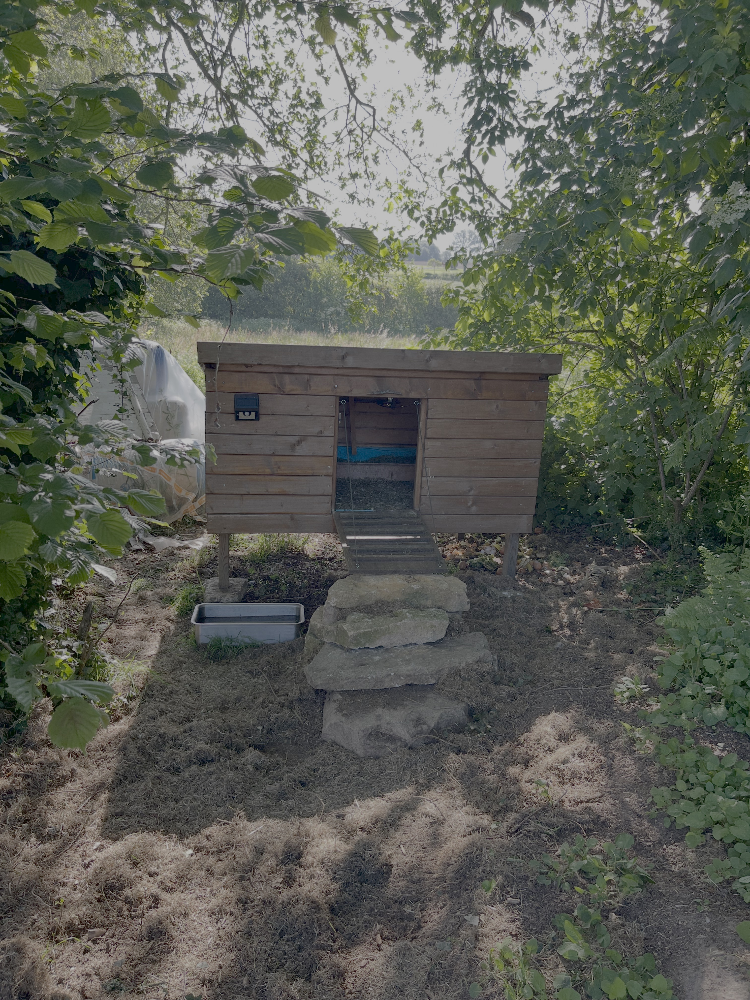
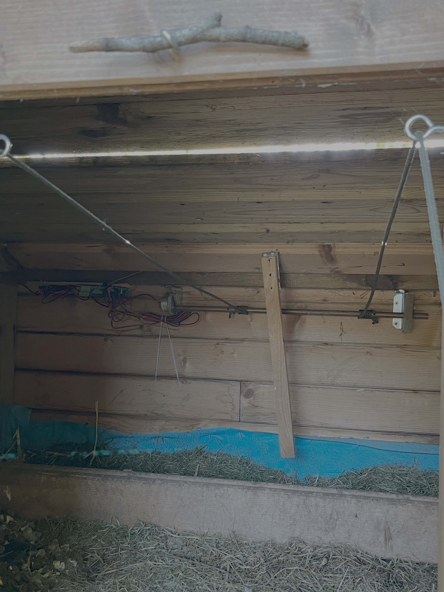
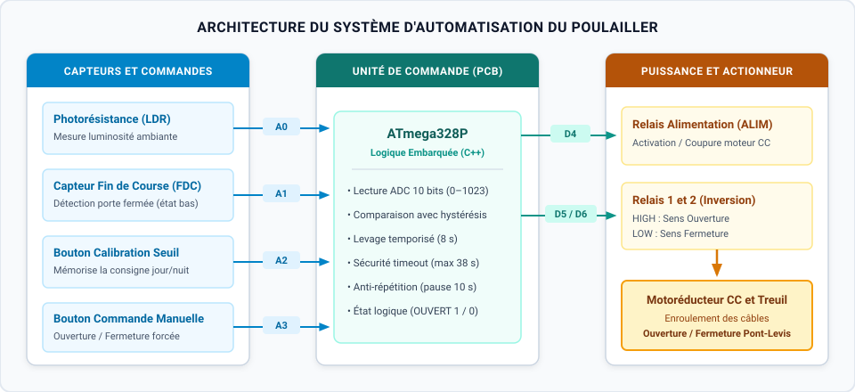
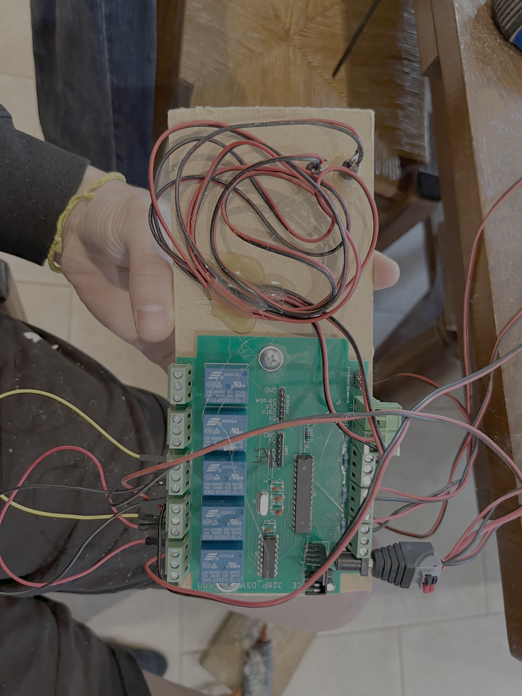
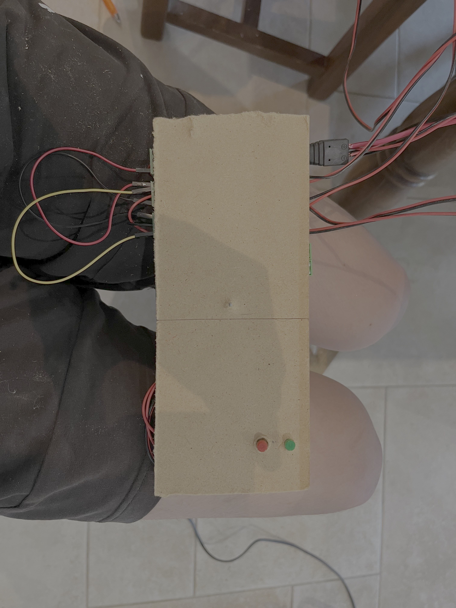

# Porte de Poulailler Automatisée (Pont-Levis Motorisé)


Système embarqué autonome assurant l'ouverture et la fermeture automatiques d'une porte de poulailler de type pont-levis en fonction de la luminosité ambiante. Le dispositif repose sur une carte de commande à microcontrôleur ATmega328P pilotant un motoréducteur à courant continu via des relais électromécaniques, avec gestion de fin de course, calibration manuelle du seuil de luminosité et commande forcée par boutons poussoirs.

---

## Sommaire
1. [Aperçu et démonstration vidéo](#aperçu-et-démonstration-vidéo)
2. [Structure du dépôt](#structure-du-dépôt)
3. [Architecture matérielle et électronique](#architecture-matérielle-et-électronique)
4. [Fonctionnement logiciel](#fonctionnement-logiciel)
5. [Installation et utilisation](#installation-et-utilisation)

---

## Aperçu et démonstration vidéo

* **[Voir la vidéo de démonstration (ouverture et fermeture du pont-levis)](assets/coop_door_demo.mov)**

| Vue extérieure du poulailler et du pont-levis | Mécanisme d'enroulement intérieur |
| :---: | :---: |
|  |  |
| *Pont-levis ouvert et boîtier de commande fixé en façade (à gauche)* | *Arbre métallique motorisé enroulant les câbles de levage de la porte* |

---

## Structure du dépôt

```text
automated-chicken-coop-door/
├── .gitignore
├── README.md
├── assets/
│   ├── chicken_coop_overview.jpg     # Vue d'ensemble du poulailler et du pont-levis
│   ├── control_box_front.jpg         # Façade du boîtier avec boutons de commande
│   ├── coop_door_demo.mov            # Vidéo de démonstration (ouverture/fermeture)
│   ├── relay_board_pcb.jpg           # Carte électronique ATmega328P et relais 5V
│   ├── system_architecture.svg       # Schéma synoptique de l'architecture matérielle
│   └── winch_mechanism_inside.jpg    # Arbre de transmission et câbles de levage
└── coop_door_firmware/
    └── coop_door_firmware.ino        # Code embarqué C++ (gestion LDR, relais et boutons)
```

---

## Architecture matérielle et électronique

### 1. Schéma synoptique du système


### 2. Carte électronique et boîtier de commande

| Carte électronique de puissance (PCB) | Façade du boîtier de commande |
| :---: | :---: |
|  |  |
| *PCB à base d'ATmega328P, relais Songle SRD-05VDC-SL-C et borniers à vis* | *Boutons poussoirs en façade (ouverture/fermeture manuelle et calibration LDR)* |

### 3. Brochage du microcontrôleur (Pinout)

| Entrée / Sortie | Broche | Type | Rôle dans le système |
|---|---|---|---|
| **`ALIM`** | `D4` | Sortie numérique | Relais principal d'alimentation du moteur CC (`HIGH` = moteur alimenté, `LOW` = arrêt). |
| **`RELAIS_1`** | `D5` | Sortie numérique | Relais d'inversion de polarité 1 (définit le sens de rotation du moteur). |
| **`RELAIS_2`** | `D6` | Sortie numérique | Relais d'inversion de polarité 2 (couplé à `RELAIS_1` pour inverser le sens). |
| **`LDR`** | `A0` | Entrée analogique | Photorésistance mesurant le niveau de luminosité extérieure (0 à 1023). |
| **`FDC`** | `A1` | Entrée numérique | Capteur de fin de course détectant la fermeture complète de la porte (actif à l'état bas `LOW`). |
| **`BUTTON_SEUIL`** | `A2` | Entrée numérique | Bouton poussoir d'étalonnage permettant d'enregistrer la luminosité actuelle comme nouveau seuil. |
| **`BUTTON_OUVERTURE_FERMETURE`** | `A3` | Entrée numérique | Bouton poussoir de commande manuelle pour forcer l'ouverture ou la fermeture. |

---

## Fonctionnement logiciel

### 1. Commande du moteur par relais (Inversion de sens)
Le pilotage du moteur à courant continu est assuré par trois relais :
* **Ouverture (`ouvre()`) :** Les relais de direction `RELAIS_1` et `RELAIS_2` sont activés (`HIGH`), puis le relais d'alimentation `ALIM` est enclenché pendant une durée fixe `TempsLevage = 8000 ms` (8 secondes) avant de couper l'alimentation.
* **Fermeture (`ferme()`) :** Les relais `RELAIS_1` et `RELAIS_2` sont placés au repos (`LOW`) pour inverser la polarité aux bornes du moteur, puis `ALIM` est activé.

### 2. Sécurité de fermeture (Fin de course et Timeout)
Lors de la descente du pont-levis, le moteur tourne tant que le capteur de fin de course n'est pas déclenché (`digitalRead(FDC) == HIGH`). Pour protéger le moteur et le mécanisme en cas de blocage mécanique de la porte ou de défaillance du capteur, une sécurité logicielle coupe automatiquement l'alimentation après un délai maximal de **38 secondes** (`TempsLevage + 30000 ms`).

### 3. Détection jour/nuit avec hystérésis et anti-répétition
* **Hystérésis :** Le déclenchement de l'ouverture intègre un écart de seuil (`analogRead(LDR) < NiveauLumiere - 10`) afin d'éviter les oscillations intempestives à l'aube ou au crépuscule lorsque la luminosité fluctue autour de la valeur limite.
* **Temporisation (`TempsAttente`) :** Après chaque mouvement complet, le système observe une pause de `10 000 ms` (10 secondes) durant laquelle aucune nouvelle commande moteur ne peut être lancée.

### 4. Calibration dynamique du seuil de luminosité
Au démarrage (`setup()`), le seuil de référence `NiveauLumiere` est initialisé avec la mesure courante de la photorésistance. À tout moment, une pression sur le bouton `BUTTON_SEUIL` (`LOW`) permet de mémoriser la luminosité ambiante actuelle comme nouvelle consigne de déclenchement.

---

## Installation et utilisation

1. Ouvrir le fichier `coop_door_firmware/coop_door_firmware.ino` dans **Arduino IDE**.
2. Sélectionner la carte **Arduino Uno** (ATmega328P) et le port série associé à l'interface UART de la carte.
3. Téléverser le programme.
4. **Réglage sur site :** À la tombée de la nuit (au moment souhaité pour la fermeture), appuyer sur le bouton de seuil (`BUTTON_SEUIL`) en façade pour enregistrer la luminosité de référence.